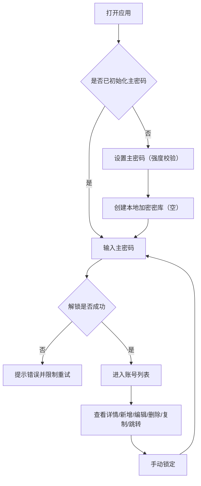

# 个人账号管理系统（本地Web单机版）｜PRD

## 1. 产品概述
一个运行在本机浏览器里的账号管理工具：用主密码解锁本地加密数据，集中存放各平台账号信息，并提供搜索、复制与到期提醒。

## 2. 核心功能
### 2.1 用户角色
本产品为单机工具，无角色区分。

### 2.2 功能模块
1. **解锁页**：主密码初始化、强度校验、解锁会话
2. **账号列表页**：搜索、类型筛选、到期状态提示、新增入口
3. **账号详情页**：字段展示、复制账号/密码、平台Key管理（多Key+有效期）、跳转网址、编辑/删除
4. **账号编辑页**：新增/编辑表单、校验与保存
5. **设置页（最小集）**：手动锁定、基础信息展示（后续扩展入口）

### 2.3 页面明细
| 页面名称 | 模块名称 | 功能描述 |
|---|---|---|
| 解锁页 | 主密码初始化 | 首次启动引导设置主密码，进行强度校验并确认 |
| 解锁页 | 解锁 | 输入主密码解锁本地密库；失败有提示与重试限制 |
| 账号列表页 | 搜索/筛选 | 关键词搜索（标题/登录账号）、按类型筛选 |
| 账号列表页 | 列表展示 | 展示标题、类型、登录账号摘要、到期/续费状态角标 |
| 账号列表页 | 新增账号 | 进入编辑页（新增模式） |
| 账号详情页 | 字段展示 | 展示账号全字段（不自动暴露明文密码） |
| 账号详情页 | 快捷操作 | 复制登录账号、复制密码、打开网址 |
| 账号详情页 | 平台Key管理 | 支持同一平台多个Key（如AI Token），新增/编辑/删除/复制，并按有效期提示 |
| 账号详情页 | 管理操作 | 编辑、删除（二次确认） |
| 账号编辑页 | 表单录入 | 必填/可选字段录入与校验 |
| 账号编辑页 | 保存 | 写入本地加密存储并返回 |
| 设置页 | 锁定 | 立即清空会话并回到解锁页 |

## 3. 核心流程
### 3.1 主流程（解锁→使用→锁定）
1. 用户打开应用
2. 若未初始化：设置主密码并创建空密库
3. 输入主密码解锁
4. 在列表中搜索/进入详情/新增编辑
5. 手动锁定（或后续版本支持自动锁定）

## 4. 用户界面设计
### 4.1 设计风格
- 视觉方向：暗色哑光底 + 细网格/噪点质感 + 荧光青绿作为强调色，整体偏“控制台仪表盘”但保持克制与清爽
- 主色：近黑（背景）、石墨灰（卡片/输入框）、荧光青绿（强调/成功）
- 组件：圆角中等、边框细线、轻微发光的聚焦态
- 字体：标题使用具性格的等宽体，正文使用清晰的人文无衬线体（实现时通过 Web Font 引入）
- 动效：解锁成功的过渡、列表项 hover 的细微位移与高亮、到期状态的轻量提示动画

### 4.2 页面设计概览
| 页面名称 | 模块名称 | UI元素 |
|---|---|---|
| 解锁页 | 密码输入 | 大标题+副标题、主密码输入框、强度提示条、主按钮、错误提示 |
| 列表页 | 搜索与筛选 | 顶部搜索框、类型下拉、右侧新增按钮（强调色） |
| 列表页 | 账号卡片 | 标题、类型徽标、到期角标、快捷入口（可选） |
| 详情页 | 快捷操作 | 复制按钮、打开网址按钮、编辑/删除按钮 |
| 编辑页 | 表单 | 分组字段、校验提示、生成密码入口（后续） |

### 4.3 响应式
- 桌面优先
- 窄屏（平板/手机）自适应：列表卡片改为单列，详情页按钮改为底部操作条
