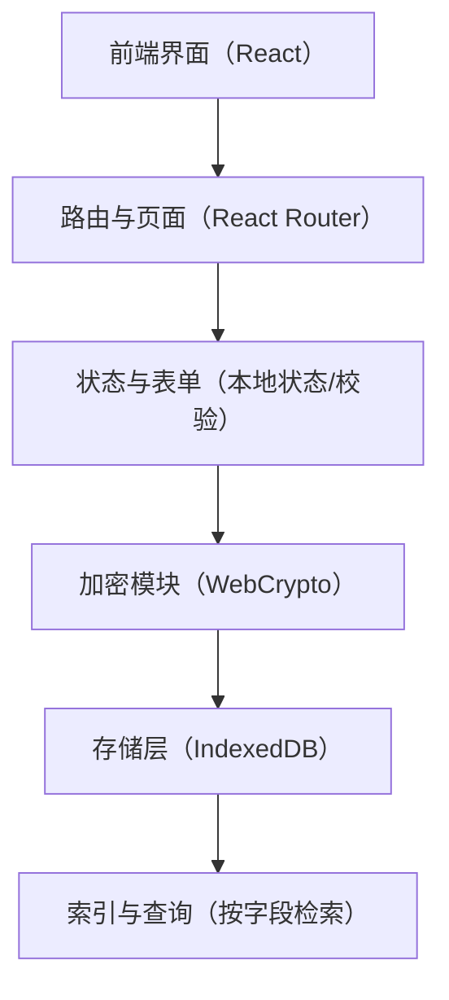
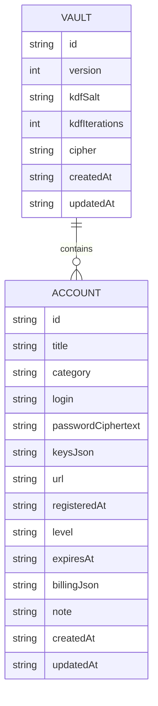

# 个人账号管理系统（本地Web单机版）｜技术架构

## 1. 架构设计

## 2. 技术说明
- 前端：React@18 + TypeScript + Vite
- 路由：react-router-dom
- 样式：CSS Variables + 组件级样式组织（是否引入 Tailwind 在实现阶段确认）
- 数据存储：IndexedDB
- 加密：
  - KDF：PBKDF2（WebCrypto）派生密钥（盐+迭代次数）
  - 对称加密：AES-GCM
  - 存储内容：仅保存密文与必要元数据（盐、迭代次数、nonce、版本号）

## 3. 路由定义
| 路由 | 用途 |
|---|---|
| /unlock | 主密码初始化与解锁 |
| /accounts | 账号列表（搜索/筛选） |
| /accounts/new | 新增账号 |
| /accounts/:id | 账号详情 |
| /accounts/:id/edit | 编辑账号 |
| /settings | 设置（最小集） |

## 4. API 定义
无后端服务。

## 5. 数据模型
### 5.1 数据模型定义

### 5.2 存储结构建议
- IndexedDB
  - meta 表：vault 元数据（salt/iterations/version/createdAt/updatedAt）
  - accounts 表：按 id 存储账号对象（敏感字段以密文形式保存）
  - settings 表：非敏感设置（例如：上次解锁时间、默认筛选等）

## 6. 关键实现要点（安全）
- 严禁将明文密码写入日志、错误上报或持久化
- 解锁会话内存中仅保留派生密钥与必要明文，锁定时彻底清理引用
- 复制到剪贴板只写入一次，不保留历史
