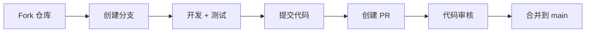

# 贡献指南

感谢您对 PersonAccount 项目的关注！欢迎以任何形式参与贡献。

## 如何贡献

### 1. 报告问题

发现 Bug 或有功能建议？请创建 [Issue](https://github.com/YOUR_USERNAME/PersonAccount/issues)。

报告问题时请提供：
- 问题描述
- 复现步骤
- 预期行为
- 实际行为
- 环境信息（Python 版本、操作系统等）

### 2. 提交代码

#### 准备工作

```bash
# Fork 仓库
# 克隆到本地
git clone https://github.com/YOUR_USERNAME/PersonAccount.git

# 创建分支
cd PersonAccount
git checkout -b feature/your-feature-name
```

#### 开发环境

```bash
# 进入 Python 目录
cd python

# 创建虚拟环境
python -m venv venv
source venv/bin/activate  # Windows: venv\Scripts\activate

# 安装开发依赖
pip install -e ".[dev]"
```

#### 代码规范

- 遵循 PEP 8 代码风格
- 使用 `black` 格式化代码
- 使用 `ruff` 检查代码
- 编写必要的测试

```bash
# 格式化代码
black src/ tests/

# 代码检查
ruff check src/
```

#### 提交测试

```bash
# 运行测试
pytest tests/ -v

# 确保所有测试通过
```

#### 提交变更

```bash
# 添加变更
git add .

# 提交（使用清晰的提交信息）
git commit -m "feat: 添加新功能"

# 推送到远程
git push origin feature/your-feature-name
```

#### 创建 Pull Request

1. 访问 GitHub 上的您的 Fork
2. 点击 "Compare & pull request"
3. 填写 PR 描述
4. 等待审核

### 3. 改进文档

文档同样重要！欢迎改进：
- README.md
- 代码注释
- 使用示例
- API 文档

## 提交信息规范

我们遵循 [Conventional Commits](https://www.conventionalcommits.org/) 规范：

- `feat`: 新功能
- `fix`: Bug 修复
- `docs`: 文档更新
- `style`: 代码格式（不影响代码运行）
- `refactor`: 重构（既不是新功能也不是修复）
- `test`: 添加或修改测试
- `chore`: 构建过程或辅助工具变动

示例：
```
feat: 添加账号到期提醒功能
fix: 修复密码加密失败的问题
docs: 更新安装说明
```

## 开发流程



## 联系方式

- 项目 Issues: https://github.com/YOUR_USERNAME/PersonAccount/issues
- 邮件：your-email@example.com

## 许可证

提交代码即表示您同意您的贡献遵循本项目的 MIT 许可证。
